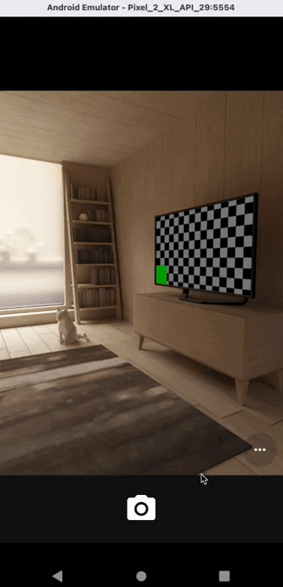

# flutter_custom_paint

## Reference
inspired by
- [thealiflab/ImageShapeApp](https://github.com/thealiflab/ImageShapeApp/blob/master/lib/rectangle_painter.dart)
- [arconsis/measurements](https://github.com/arconsis/measurements/issues)
- [Drawing rectangle between two points with arbitrary width](https://stackoverflow.com/questions/7854043/drawing-rectangle-between-two-points-with-arbitrary-width)